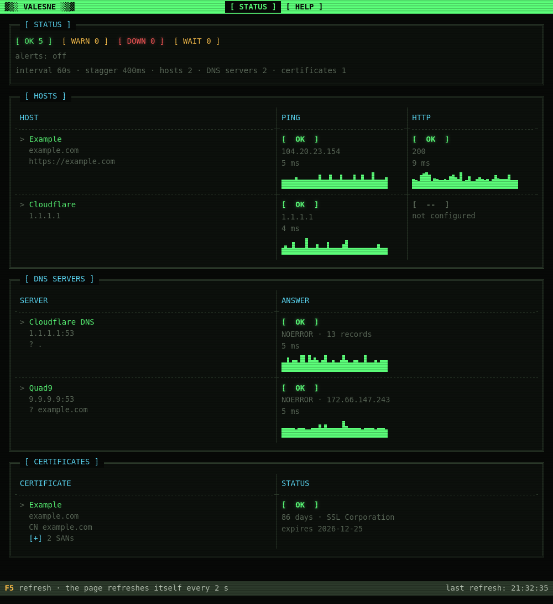

# valesne

*valesne* (Latin: "are you well?") is a small, self-hosted monitor for a home
lab or small office. It checks hosts, DNS servers, TLS certificates and Docker
containers, shows the results on a terminal-styled web page and sends push
alerts to your phone through [ntfy](https://ntfy.sh).

One Go binary with the web page built in, no database. The config is a single
TOML file that is reloaded automatically.



## What it checks

- **Hosts:** ping, plus an HTTP GET when a `url` is set (which status codes
  count as OK can be set per host).
- **DNS servers:** a query sent directly to each server, bypassing the system
  resolver.
- **TLS certificates:** the certificate a server actually serves, with a warning
  when a renewal (e.g. by certbot) is overdue and a failure shortly before it
  expires. It can connect to the origin behind a proxy like Cloudflare.
- **Docker:** the daemon and its containers (running, healthy, restarts).
  Containers listed in `monitored` must be running; the others are only shown.

The last 40 results of each check are drawn as small latency graphs.

## Alerts

Alerts are sent through ntfy, only when a state changes ("Server is DOWN", later
"Server recovered after 12m") and only after 3 failed rounds in a row, so a
single lost ping doesn't wake you up. All changes of one round go into one
message. `mute` / `mute_until` silence alerts during maintenance, and an
optional `heartbeat_url` (e.g. healthchecks.io) tells you when the whole server
is down. A line on the STATUS page shows whether ntfy and the heartbeat work
(`alerts: ntfy ok, last sent 14:02 · heartbeat ok 14:05`), amber when they
fail.

## Quick start

With Docker, using the released image (nothing to compile):

```sh
mkdir valesne && cd valesne
curl -O https://raw.githubusercontent.com/uros678/valesne/master/docker-compose.yml
mkdir config
docker compose up -d
```

`mkdir config` matters: otherwise Docker creates the folder as root and the
app, which runs as user 1000 (not root), cannot write its config there. If
your user is not 1000 (`id -u`), see `UID` / `GID` below.

Open http://localhost:9090. On first start a commented default
`config/config.toml` is written; edit it and the changes are picked up within
a few seconds, no restart needed. The HELP page explains every setting with an
example; the configuration itself is only edited in the file.

```toml
targets = [
  { name = "Router", host = "192.168.1.1" },
  { name = "Wiki",   url  = "https://wiki.example.com" },
]
dns_servers = [ { name = "Cloudflare", server = "1.1.1.1" } ]
certs       = [ { name = "My site", host = "example.com" } ]
ntfy_url    = "https://ntfy.sh/<long random topic>"
```

Test the alerts with
`docker compose exec valesne /valesne -test-alert -config /config/config.toml`.
Update with `docker compose pull && docker compose up -d`.

## Docker

The image (`ghcr.io/uros678/valesne`, linux/amd64 and linux/arm64, e.g. a
Raspberry Pi with a 64-bit OS) is small (`distroless/static`) and runs as a
normal user. Tags: `latest`, a version (`0.4.1`) and a minor version (`0.4`,
gets the fixes of that line).

Optional settings go in a `.env` file next to `docker-compose.yml`: `PORT`
(host port, default 9090), `UID` / `GID` (the user the app runs as, default
1000; it must be able to write `./config`, so set them to your own `id -u` /
`id -g` if those are not 1000) and `TZ` (time zone, default UTC).

The Docker check (`docker_check = true` in the config) goes through a
read-only socket proxy (`tecnativa/docker-socket-proxy`) that the compose file
starts as well, so valesne never sees the Docker socket itself. In the
container, `localhost` is the container: check the Docker host by its LAN IP.

## Without Docker

Runs on Linux and Windows as a single file. Download it from
[Releases](https://github.com/uros678/valesne/releases/latest)
(`valesne-linux-amd64`, `valesne-linux-arm64`, `valesne-windows-amd64.exe`;
checksums in `SHA256SUMS`), or build it with Go (`go build -o valesne .`):

```sh
chmod +x valesne-linux-amd64
./valesne-linux-amd64 -config config.toml
```

Other flags: `-version`, `-test-alert` (sends a test notification) and
`-healthcheck` (used by the Docker image).

On Linux, ping needs `net.ipv4.ping_group_range` to include the user (or
root / `CAP_NET_RAW`); Docker sets this up inside containers.

## Security

valesne has no login. The STATUS page and `/api/status` show your host names,
IP addresses, DNS servers and containers to anyone who can reach the port. Run
it on your LAN only, or put it behind a reverse proxy with authentication; do
not expose it to the internet. The ntfy and heartbeat URLs are never shown on a
page, but anyone who knows your ntfy topic can read your alerts: use a long
random topic or an access token (`ntfy_token`).

## Build and test

Dependencies: `golang.org/x/net`, `golang.org/x/sys`
and `github.com/BurntSushi/toml`.

```sh
go vet ./...
go test ./...
```

## License

MIT, see [LICENSE](LICENSE).
